# Planning 功能树（Function Tree）

> 功能树回答：**「计划管理模块有什么功能？」**
> 只表达功能层级关系，**不画输入输出数据箭头**（数据流向见 [planning-level1-dfd.md](planning-level1-dfd.md)）。

## Mermaid 源码

```mermaid
flowchart TD
    Root["计划管理"]

    Root --> F1["主生产计划 MPS"]
    Root --> F2["物料需求计划 MRP"]
    Root --> F3["生产作业计划"]
    Root --> F4["派工单管理"]
    Root --> F5["领料单管理"]
    Root --> F6["综合查询与统计分析"]

    F1 --> F11["MPS 导入"]
    F1 --> F12["MPS 维护"]
    F1 --> F13["MPS 确认"]
    F1 --> F14["MPS 查询"]

    F2 --> F21["MRP 参数设置"]
    F2 --> F22["BOM 逐层展开"]
    F2 --> F23["毛需求计算"]
    F2 --> F24["库存净算"]
    F2 --> F25["净需求计算"]
    F2 --> F26["MRP 结果确认"]

    F3 --> F31["自制件需求生成"]
    F3 --> F32["作业计划维护"]

    F4 --> F41["派工单生成"]
    F4 --> F42["派工单下达"]
    F4 --> F43["派工状态查询"]

    F5 --> F51["领料单生成"]
    F5 --> F52["领料单下达"]
    F5 --> F53["领料状态查询"]

    F6 --> F61["MPS 查询"]
    F6 --> F62["MRP 查询"]
    F6 --> F63["生产计划查询"]
    F6 --> F64["计划执行状态统计"]
```



## 文字层级

```
计划管理
├── 主生产计划 MPS
│   ├── MPS 导入
│   ├── MPS 维护
│   ├── MPS 确认
│   └── MPS 查询
├── 物料需求计划 MRP
│   ├── MRP 参数设置
│   ├── BOM 逐层展开
│   ├── 毛需求计算
│   ├── 库存净算
│   ├── 净需求计算
│   └── MRP 结果确认
├── 生产作业计划
│   ├── 自制件需求生成
│   └── 作业计划维护
├── 派工单管理
│   ├── 派工单生成
│   ├── 派工单下达
│   └── 派工状态查询
├── 领料单管理
│   ├── 领料单生成
│   ├── 领料单下达
│   └── 领料状态查询
└── 综合查询与统计分析
    ├── MPS 查询
    ├── MRP 查询
    ├── 生产计划查询
    └── 计划执行状态统计
```

## 设计说明

1. **MRP、生产作业计划、派工单、领料单、综合查询统计是课程任务书明确要求**的功能；**主生产计划 MPS** 因课程案例以「附录 1 主生产计划」为计划输入而加入，作为本模块的输入与管理对象。
2. MRP 的内部逻辑链为：**参数设置 → BOM 逐层展开 → 毛需求计算 → 库存净算 → 净需求计算 → 结果确认**。
3. 功能边界（**本期不扩展**）：不含 CRP 能力需求计划、APS / 高级排产、有限产能优化、JIT、AI 排产、数字孪生、大模型——除非课程后续明确要求。
4. 叶子功能即后续页面的功能单元，与 [week2-functional-design.md](../week2-functional-design.md) 第九节「页面初步规划」对应。
