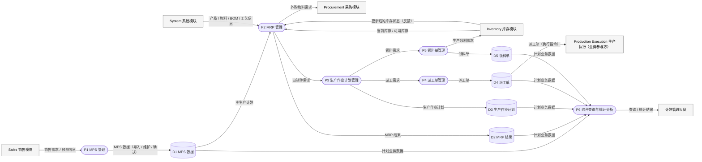

# Planning 第一层数据流图（Level-1 DFD）

> DFD 回答：**「数据如何在计划管理模块中流动？」**
> 与功能树（[planning-function-tree.md](planning-function-tree.md)）分工不同：功能树只表达层级，DFD 表达数据流。

## 一、DFD 符号含义

| 符号（本图 Mermaid 表达） | DFD 含义 | 说明 |
| --- | --- | --- |
| 方框 `[...]` | 外部实体（External Entity） | 系统之外的数据来源或去向（含兄弟模块与业务参与方） |
| 圆形 `((...))` | 处理过程（Process，P1–P6） | 对数据进行加工的功能 |
| 圆柱 `[(...)]` | 数据存储（Data Store，D1–D5） | 本模块拥有的持久化数据 |
| 带文字标注的箭头 | 数据流（Data Flow） | 箭头上**必须标注数据名称**，且每条数据都有明确的来源与去向 |

## 二、Mermaid 源码

## 三、逐项解释

### 外部实体

| 实体 | 与本模块的关系 |
| --- | --- |
| Sales 销售模块 | 提供销售需求 / 预测信息，是 MPS 的需求来源 |
| System 系统模块 | 提供产品、物料、BOM、工艺等基础主数据（Planning **只读**） |
| Inventory 库存模块 | 提供当前库存 / 可用库存；接收生产领料需求；库存变化后反馈最新状态（计划闭环） |
| Procurement 采购模块 | 接收 MRP 外购物料需求并执行采购 |
| Production Execution 生产执行 | 车间执行对象 / 业务参与方，接收派工单执行生产。**不是第六个软件模块** |
| 计划管理人员 | 使用综合查询与统计分析的用户 |

### 处理过程

| 过程 | 处理内容 |
| --- | --- |
| P1 MPS 管理 | 导入、维护、确认附录 1 MPS，写入 D1 |
| P2 MRP 管理 | 读取 D1 + System 主数据 + Inventory 库存，BOM 逐层展开、毛需求计算、库存净算、净需求计算，写入 D2，并将净需求按物料属性分解为外购 / 自制 |
| P3 生产作业计划管理 | 接收自制件需求，生成并维护生产作业计划，写入 D3，向 P4 / P5 发出派工需求与领料需求 |
| P4 派工单管理 | 生成并下达派工单，写入 D4，提供给生产执行 |
| P5 领料单管理 | 生成并下达领料单，写入 D5，向 Inventory 发出生产领料需求 |
| P6 综合查询与统计分析 | 读取 D1–D5，向计划管理人员提供查询与统计结果（课程任务书要求项；显式画出以保证每个数据存储都有去向） |

### 数据存储（全部为 Planning 自有）

| 存储 | 对应数据所有权规划中的表（第 3 周建表） |
| --- | --- |
| D1 MPS 数据 | `mps` / `mps_line` |
| D2 MRP 结果 | `mrp_result` |
| D3 生产作业计划 | `production_work_plan`（及 `planned_order`） |
| D4 派工单 | `dispatch_order` |
| D5 领料单 | `material_requisition` / `material_requisition_line` |

### 输入数据流（进入本模块）

| 数据流 | 来源 → 去向 |
| --- | --- |
| 销售需求 / 预测信息 | Sales → P1 |
| 产品 / 物料 / BOM / 工艺信息 | System → P2 |
| 当前库存 / 可用库存 | Inventory → P2 |
| 更新后的库存状态（反馈） | Inventory → P2 |

### 输出数据流（离开本模块）

| 数据流 | 来源 → 去向 |
| --- | --- |
| 外购物料需求 | P2 → Procurement |
| 派工单（执行指令） | D4 → Production Execution |
| 生产领料需求 | P5 → Inventory |
| 查询 / 统计结果 | P6 → 计划管理人员 |

### 内部数据流

`P1 → D1 → P2 → D2`，`P2 → P3 → D3`，`P3 → P4 / P5`，`P4 → D4`，`P5 → D5`，`D1–D5 → P6`。

## 四、设计约束（自查）

1. **BOM 不是 Planning 的数据存储**（归 system）；**库存余额不是 Planning 的数据存储**（归 inventory）——图中它们只以「外部实体提供的数据流」出现，未画成 D 存储。
2. 每条数据流都标注了数据名称，且都有明确来源与去向——不存在无来源 / 无去向的数据。
3. 箭头表达的是**数据**而非操作动作（如「下达」「导入」是过程内的处理，不作为数据流名称）。
4. 不直接访问其他模块的 repository / 表；实现期一律通过约定的 Service / API Contract（见 [../interface-draft.md](../interface-draft.md)）。
