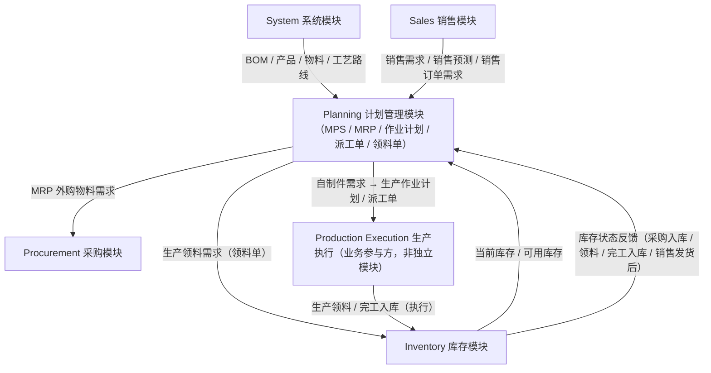

# Planning 与其他模块的关系图

> 以 Planning 为中心，展示它与 system / sales / procurement / inventory 四个模块及生产执行之间的数据往来。

## Mermaid 源码



对应文字结构：

```
                     System
              BOM / 产品 / 工艺
                       │
                       ↓
Sales ──需求────→ Planning ←──── Inventory
                   │   ↑           当前库存
                   │   │
                   │   └────库存反馈
              MPS / MRP
                ↙      ↘
            外购需求    自制需求
               ↓          ↓
        Procurement    作业计划
                         ↓
                     派工/领料
                         ↓
                     Inventory
```

## 数据所有权限定

Planning **不应该直接修改**：

- system 的业务数据（产品、物料、BOM、工艺路线等主数据，只读）
- procurement 的订单（采购订单由 procurement 创建维护）
- inventory 的库存余额（库存数量只由 inventory 维护）

Planning **只产生并维护**自己拥有的数据：

- MPS（`mps` / `mps_line`）
- MRP 结果（`mrp_result`）
- 生产作业计划（`production_work_plan` / `planned_order`）
- 派工单（`dispatch_order`）
- 领料单（`material_requisition` / `material_requisition_line`）

## 关键反馈环

**Inventory 的实时库存状态必须反馈给 Planning**，用于 MRP 净需求计算。
这是 MTS 模式下「库存 → 计划」的闭环，也是本系统区别于纯订单式系统的核心。

## 跨模块通信方式

图中所有跨模块箭头，实现期一律通过约定的 **Service / API Contract** 完成：

- 禁止 import 其他模块的 `service.py` / `repository.py` / `models.py`
- 禁止跨模块直读 / JOIN 其他模块的表
- 具体数据需求清单见 [../interface-draft.md](../interface-draft.md)
- 边界规则见 [../../architecture/module-boundaries.md](../../architecture/module-boundaries.md)
