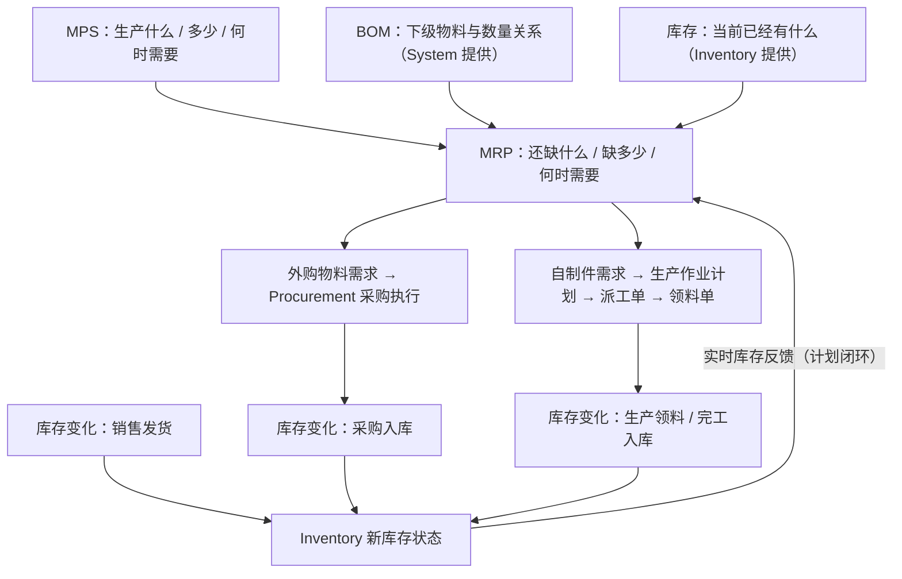

# Planning Module 软件功能初步设计方案（第 2 周）

> 课程：《现代制造信息技术专业课程设计》· 第 2 周交付物
> 范围：**只做功能初步设计**。不实现 MRP 算法、不建业务表、不做业务页面、不做跨模块真实调用。
> 详细功能设计与数据结构模型设计留待第 3 周（见 [week3-detailed-design.md](week3-detailed-design.md)）。

## 一、模块定位

计划管理模块是 BH-ERP 制造业务的**计划中枢**。

它负责将：

- 市场 / 销售需求（来自 sales）
- 主生产计划 MPS（课程附录 1，由本模块导入与管理）
- 产品 BOM 与工艺路线（来自 system）
- 当前库存（来自 inventory）

转换为：

- MRP 物料需求
- 采购需求（交 procurement 执行）
- 生产作业计划
- 派工单
- 领料单

并通过库存状态反馈形成计划闭环。

五个模块的分工定位：

| 模块 | 定位 |
| --- | --- |
| system | 基础数据来源（产品、物料、BOM、工艺路线、组织人员、权限） |
| sales | 需求来源（销售需求、销售预测、销售订单、发货） |
| **planning** | **计划计算与计划生成中心（MPS → MRP → 作业计划 / 派工单 / 领料单）** |
| procurement | 外购物料需求执行方（采购计划、采购订单、到货） |
| inventory | 库存状态提供方及领料执行方（出入库、实时库存） |

生产模式为 **MTS（Make To Stock，面向库存生产）**：按预测与库存提前组织生产入库，
客户订单到达后由库存直接发货。因此 **MPS 与 MRP 是整条业务链的发动机**，
库存 → 计划的反馈闭环是 MTS 模式的核心。

## 二、业务边界

### 本模块做（课程任务书要求）

1. MRP 物料需求计划展开
2. 车间生产作业计划展开
3. 派工单管理
4. 领料单管理
5. 综合查询与统计分析

另因课程案例以**附录 1 主生产计划（MPS）**为计划输入，MPS 管理作为本模块的输入与管理对象加入。

### 本模块不做

- CRP 能力需求计划、APS / 高级排产、有限产能优化
- JIT、AI 排产、数字孪生、大模型
- 生产执行本身（车间执行是业务参与方，**不建第六个 production 软件模块**）
- 销售、采购、库存、基础数据的业务操作（只通过接口消费）

## 三、核心业务逻辑

```
MPS        决定：生产什么、生产多少、何时需要
BOM        决定：生产这些产品需要哪些下级物料以及数量关系
Inventory  决定：当前已经有什么
MRP        计算：还缺什么、缺多少、何时需要
    ↓ 按物料属性分解
外购物料 → Procurement（采购执行）
自制件   → 生产作业计划 → 派工单 → 领料单（生产执行）
```

库存变化（采购入库、生产领料、完工入库、销售发货）都会改变 Inventory；
新的库存状态再反馈回 Planning / MRP，形成计划反馈闭环。



> 本周只分析逻辑，不实现算法。MRP 详细处理逻辑（展开顺序、提前期、需求日期）属第 3 周内容。

## 四、功能树

详见 [diagrams/planning-function-tree.md](diagrams/planning-function-tree.md)（Mermaid 可渲染）。文字层级：

```
计划管理
├── 1. 主生产计划 MPS：导入 / 维护 / 确认 / 查询
├── 2. 物料需求计划 MRP：参数设置 / BOM 逐层展开 / 毛需求计算 / 库存净算 / 净需求计算 / 结果确认
├── 3. 生产作业计划：自制件需求生成 / 作业计划维护
├── 4. 派工单管理：生成 / 下达 / 状态查询
├── 5. 领料单管理：生成 / 下达 / 状态查询
└── 6. 综合查询与统计分析：MPS 查询 / MRP 查询 / 生产计划查询 / 计划执行状态统计
```

## 五、与其他模块的关系

详见 [diagrams/planning-module-relations.md](diagrams/planning-module-relations.md)。要点：

- Planning **不直接修改** system 的业务数据、procurement 的订单、inventory 的库存余额。
- Planning 只产生并维护自己的数据：**MPS、MRP 结果、生产作业计划、派工单、领料单**
  （对应数据所有权规划中的 `mps` / `mps_line` / `mrp_result` / `planned_order` / `production_work_plan` / `dispatch_order` / `material_requisition`(+`_line`)）。
- 跨模块业务后续通过统一的 Service / API Contract 完成，禁止直读其他模块的表。

## 六、第一层数据流图（DFD）

详见 [diagrams/planning-level1-dfd.md](diagrams/planning-level1-dfd.md)（含 Mermaid 源码与逐项解释）。

要点：BOM 与库存余额**不是** Planning 拥有的数据存储，图中只以「外部实体提供的数据流」出现；
Planning 的数据存储只有 D1–D5（MPS 数据 / MRP 结果 / 生产作业计划 / 派工单 / 领料单）。

## 七、输入—处理—输出分析

| 功能 | 输入 | 处理 | 输出 | 数据来源 / 去向 |
| --- | --- | --- | --- | --- |
| MPS 管理 | 附录 1 MPS、销售需求 | 导入、维护、确认 | 确认后的 MPS | 来源：sales / 人工录入；去向：D1 → MRP |
| MRP 管理 | 确认后的 MPS、BOM、库存状态 | 参数设置、BOM 逐层展开、毛需求计算、库存净算、净需求计算 | MRP 结果、外购需求、自制需求 | 来源：D1、system、inventory；去向：D2、procurement、生产作业计划 |
| 生产作业计划 | MRP 自制件需求 | 计划生成、维护 | 生产作业计划 | 来源：MRP 结果；去向：D3、派工单、领料单 |
| 派工单 | 生产作业计划 | 派工单生成、下达 | 派工单 | 来源：D3；去向：D4、生产执行 |
| 领料单 | 生产作业计划 / BOM 用料需求 | 领料单生成、下达 | 领料单、生产领料需求 | 来源：D3、BOM（system，只读）；去向：D5、inventory |
| 综合查询与统计分析 | 计划业务数据（D1–D5） | 条件查询、汇总统计 | 查询 / 统计结果 | 来源：本模块各数据存储；去向：计划管理人员 |

> 本周只做到逻辑级别，**不设计正式数据库字段**（第 3 周完成 E-R 模型与物理模型）。

## 八、跨模块数据需求（接口草案摘要）

详见 [interface-draft.md](interface-draft.md)。摘要：

| 数据 | Provider | Consumer | Purpose |
| --- | --- | --- | --- |
| BOM | System | Planning | MRP 逐层展开 |
| 产品 / 物料 / 工艺信息 | System | Planning | MPS / MRP / 作业计划基础数据 |
| 销售需求 / 预测 / 订单需求 | Sales | Planning | MPS 制定的需求来源 |
| Inventory Balance（当前 / 可用库存） | Inventory | Planning | 净需求计算；库存反馈闭环 |
| Purchase Requirement（外购需求） | Planning | Procurement | 生成采购计划 |
| Material Requisition（领料单 / 领料需求） | Planning | Inventory | 生产领料出库 |
| 生产作业计划 / 派工信息 | Planning | 生产执行 | 车间任务下达 |

## 九、页面初步规划

后续 planning 菜单（**本周不实现页面，现有占位页面保留**）：

```
计划管理
├── 主生产计划 MPS
├── MRP 物料需求计划
├── 生产作业计划
├── 派工单
├── 领料单
└── 综合查询
```

| 页面 | 目的 | 主要输入 | 主要输出 | 核心操作 |
| --- | --- | --- | --- | --- |
| 主生产计划 MPS | 录入与维护附录 1 MPS | MPS 数据（期间、产品、数量）、销售需求 | 确认后的 MPS | 导入、查询、维护、确认 |
| MRP 物料需求计划 | 基于 MPS + BOM + 库存执行 MRP | 确认后的 MPS | MRP 结果（外购 / 自制需求） | 运行 MRP、结果查询、结果确认 |
| 生产作业计划 | 将自制件需求转为车间作业计划 | MRP 自制件需求 | 生产作业计划 | 生成、维护、查询 |
| 派工单 | 下达车间作业任务 | 生产作业计划 | 派工单 | 生成、下达、状态查询 |
| 领料单 | 生成并跟踪生产领料需求 | 生产作业计划 / BOM 用料 | 领料单、领料需求 | 生成、下达、状态查询 |
| 综合查询 | 跨单据查询与统计 | 查询条件 | MPS / MRP / 生产计划查询结果、执行状态统计 | 条件查询、统计 |

MRP 页面后续预计显示列：

> 物料编码、物料名称、BOM 层级、物料属性、毛需求、可用库存、净需求、需求日期、采购 / 自制属性

## 十、Development Technology（开发技术选型记录）

沿用项目已统一确定的技术栈，planning 模块不单独更换：

| 层 | 技术 |
| --- | --- |
| Frontend | Vue 3 · TypeScript · Element Plus · Axios（Vite · Pinia · Vue Router） |
| Backend | Python · FastAPI · SQLAlchemy 2.x · Pydantic v2 |
| Database | MySQL 8.x（utf8mb4） |
| Migration | Alembic |

为什么适合 Planning：

- **Web B/S 架构**：浏览器即可使用，适合课程演示与多人协作开发。
- **前后端分离 + REST 接口**：模块间以 HTTP / Contract 集成，天然支持「计划中枢」与另外四个模块的解耦。
- **关系数据库**：MPS、MRP 结果、派工单、领料单都是强结构化单据数据，MySQL 关系模型完全匹配。
- **模块化目录（router → service → repository 分层）**：支持五人并行开发且互不干扰，满足课程分组要求。

## 十一、Integration Issues / 待协调问题

> 以下问题**不在本模块单方修改**，记录在此，需组内沟通后处理：

1. `docs/README.md` 文档索引尚未加入 `docs/planning/` 入口（公共文件，需组内确认后补充）。
2. 跨模块 Contract（`contract.py`）机制尚未建立：
   - planning 需要从 system 读 BOM / 物料 / 产品、从 sales 读销售需求、从 inventory 读库存；
   - planning 需要向 procurement 提供采购需求、向 inventory 提供领料需求。
   以上接口的函数名 / 路径 / 出入参需与各 Owner 约定（见 [interface-draft.md](interface-draft.md)）。
3. 前端 planning 子菜单落地时会涉及公共文件 `frontend/src/layouts/menu.ts` 与 `frontend/src/router/routes.ts`，届时需提前沟通。
4. Production Execution 仅作为业务参与方出现在设计中，**不创建第六个软件模块**。
5. 转椅 BOM 与附录 1 MPS 正式数据本周不导入，后续分别由 system 与 planning 在各自开发阶段录入。

## 十二、第 3 周 TODO

- [ ] 详细功能模型
- [ ] MRP 处理逻辑（展开顺序、净需求算法、提前期处理）
- [ ] 数据实体关系与 E-R 模型
- [ ] 数据结构物理模型（建表设计 + Alembic 迁移设计）
- [ ] API 详细定义（基于接口草案细化）
- [ ] 页面详细设计
- [ ] 模块集成 / 联调方案
