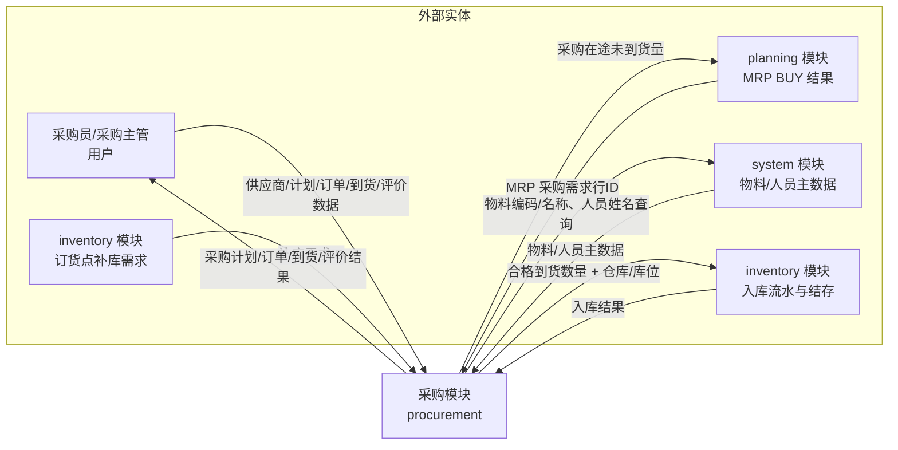
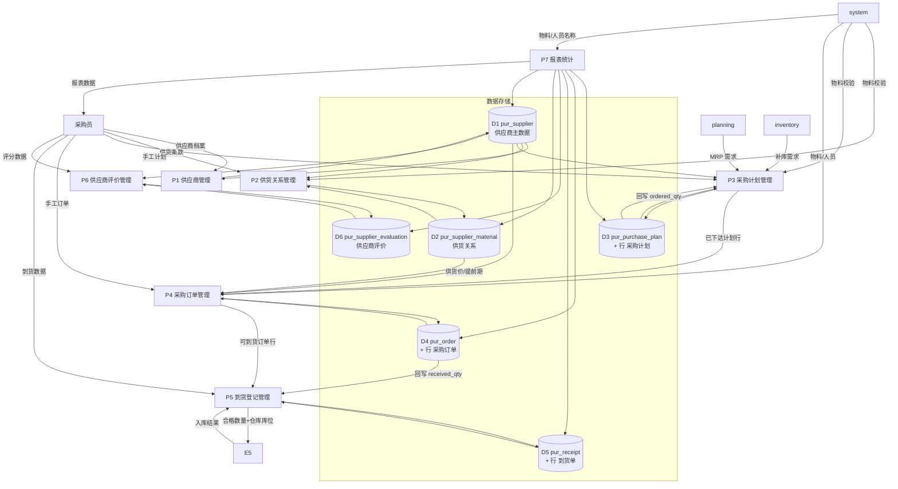
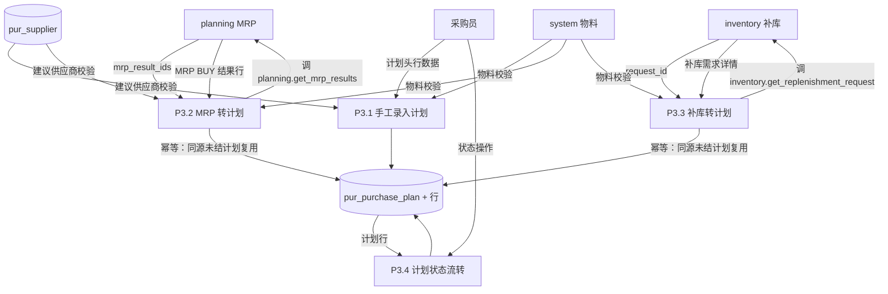

# 采购模块数据流图（Data Flow Diagrams）

> 本文描述采购模块的各级数据流图（DFD），与 [functional-design.md](functional-design.md)
> 的业务流程、[er-diagram.md](er-diagram.md) 的实体关系、[physical-data-model.md](physical-data-model.md)
> 的物理表结构相互印证。
>
> 图中数据存储（D）均为本模块自有 `pur_*` 表；外部实体（E）为其他模块或用户；
> 处理过程（P）为本模块的业务功能。跨模块数据流只通过 Service Contract 传递，
> 不直接读写对方数据表。

## 一、上下文图（Context Diagram）

采购模块作为单一处理，与外部实体交互的最高层视图：



**说明：**

- **E1（采购员）**：人工触发供应商维护、手工录入计划/订单、登记到货、评价供应商等操作。
- **E2（planning）**：MRP 运算产生 BUY 类型物料需求，经契约 `create_purchase_plan_from_mrp` 转采购计划；
  MRP 运行时可查询 `get_pending_receipt_qty` 获取在途量。
- **E3（inventory）**：库存低于订货点时产生补库需求，经契约 `create_purchase_plan_from_replenishment` 转采购计划。
- **E4（system）**：提供物料、人员主数据（只读），用于展示编码/名称与存在性校验。
- **E5（inventory）**：到货确认时调用 `increase_stock` 写入库流水与结存（强一致写操作）。

## 二、0 级数据流图（Level 0）

将采购模块分解为 7 个主要处理过程，以及核心数据存储：



**0 级处理过程说明：**

| 过程 | 名称 | 输入 | 输出 | 读写数据存储 |
| --- | --- | --- | --- | --- |
| P1 | 供应商管理 | 供应商档案 | 供应商记录 | D1 |
| P2 | 供货关系管理 | 供货条款、物料ID | 供货关系记录 | D1, D2 |
| P3 | 采购计划管理 | 手工计划、MRP/补库需求 | 采购计划单 | D1, D3 |
| P4 | 采购订单管理 | 手工订单、已下达计划行 | 采购订单单 | D1, D2, D3, D4 |
| P5 | 到货登记管理 | 到货数据、可到货订单行 | 到货单、库存入库指令 | D4, D5 |
| P6 | 供应商评价管理 | 评分数据 | 评价记录 | D1, D6 |
| P7 | 报表统计 | 查询条件 | 各类报表 | D1~D6 |

## 三、1 级数据流图（Level 1）

对核心业务过程 P3、P4、P5 进行细化，它们是采购模块数据流转的主干。

### 3.1 P3 采购计划管理（细化）



**P3 子过程说明：**

- **P3.1 手工录入**：采购员直接录入计划头 + 行（物料、需求数量、需求日期、来源=MANUAL）。
- **P3.2 MRP 转计划**：planning 模块传入 `mrp_result_ids`，本模块经契约读取 MRP BUY 结果行，
  创建/复用采购计划（`source_type=MRP`，`source_reference_id` 指向 MRP 结果行）。
- **P3.3 补库转计划**：inventory 传入 `request_id`，经契约读取补库需求，创建采购计划
  （`source_type=REORDER`）。
- **P3.4 状态流转**：`DRAFT → CONFIRMED → RELEASED → COMPLETED`，非终态可取消。

### 3.2 P4 采购订单管理（细化）

```mermaid
flowchart TB
    E1[采购员]
    E4[system 物料/人员]

    P4_1[P4.1 手工创建订单]
    P4_2[P4.2 由计划生成订单]
    P4_3[P4.3 订单状态流转]

    D1[(pur_supplier)]
    D2[(pur_supplier_material)]
    D3[(pur_purchase_plan + 行)]
    D4[(pur_order + 行)]

    E1 -->|订单头行数据| P4_1
    E1 -->|计划ID + 供应商ID| P4_2

    %% 手工订单
    D1 -->|供应商校验| P4_1
    E4 -->|物料/人员校验| P4_1
    P4_1 -->|金额=数量×单价| D4

    %% 计划转订单
    D3 -->|未下单行 (required-ordered>0)| P4_2
    D2 -->|supply_price / lead_time_days| P4_2
    D1 -->|供应商校验| P4_2
    P4_2 -->|创建订单行 + 回写 ordered_qty| D4
    P4_2 -->|回写| D3

    %% 状态流转
    D4 -->|订单| P4_3
    E1 -->|状态操作| P4_3
    P4_3 --> D4
```

**P4 子过程说明：**

- **P4.1 手工创建**：采购员录入订单头 + 行，单价手工输入，金额 = 数量 × 单价。
- **P4.2 由计划生成**：取已下达计划的「未下单数量 > 0」的行，单价取 `pur_supplier_material.supply_price`，
  预计到货日 = 下单日 + 最大供货提前期；保存时回写计划行 `ordered_qty`。
- **P4.3 状态流转**：`DRAFT → CONFIRMED → RELEASED → IN_PROGRESS → COMPLETED`，
  其中 `IN_PROGRESS` 和 `COMPLETED` 由到货确认自动推进，非终态可取消。

### 3.3 P5 到货登记管理（细化）

```mermaid
flowchart TB
    E1[采购员]
    E5[inventory 库存]

    P5_1[P5.1 创建到货草稿]
    P5_2[P5.2 到货数量校验]
    P5_3[P5.3 确认到货（入库）]
    P5_4[P5.4 取消到货]

    D4[(pur_order + 行)]
    D5[(pur_receipt + 行)]

    E1 -->|订单ID + 到货行| P5_1
    D4 -->|可到货订单行| P5_1
    P5_1 -->|status=DRAFT| D5

    D5 -->|到货行| P5_2
    D4 -->|订单行数量与已到货量| P5_2
    P5_2 -->|超交 4004 拦截| E1

    P5_3 -->|逐行调 increase_stock| E5
    E5 -->|入库成功/失败(4007)| P5_3
    P5_3 -->|回写 received_qty| D4
    P5_3 -->|status=COMPLETED| D5
    P5_3 -->|订单 IN_PROGRESS/COMPLETED| D4

    D5 -->|DRAFT 到货单| P5_4
    P5_4 -->|status=CANCELLED| D5
```

**P5 子过程说明：**

- **P5.1 创建草稿**：选择可到货订单（`CONFIRMED/RELEASED/IN_PROGRESS`），逐行登记到货数量与合格数量。
- **P5.2 数量校验**：累计到货量不得超过订单行数量，超出抛 `4004`。
- **P5.3 确认到货（核心跨模块写操作）**：
  1. 逐行经 `integrations.increase_stock` 调用 inventory 契约写入库流水 + 结存；
  2. 回写订单行 `received_qty`；
  3. 到货单状态 → `COMPLETED`；
  4. 订单状态 → `IN_PROGRESS`（部分到货）或 `COMPLETED`（全部到齐）；
  5. 全部在同一事务，inventory 契约未就绪抛 `4007`，整单回滚。
- **P5.4 取消**：仅 `DRAFT` 状态可取消。

## 四、关键数据流清单

| 数据流 | 来源 | 去向 | 内容 | 传输方式 |
| --- | --- | --- | --- | --- |
| MRP 采购需求 | planning | procurement | mrp_result_ids | contract.create_purchase_plan_from_mrp |
| 补库需求 | inventory | procurement | request_id | contract.create_purchase_plan_from_replenishment |
| 物料主数据 | system | procurement | 物料编码/名称 | integrations.get_material(s) |
| 人员主数据 | system | procurement | 人员姓名 | integrations.get_personnel_name |
| 合格到货入库 | procurement | inventory | 物料、数量、仓库、库位、单价 | integrations.increase_stock |
| 在途未到货量 | procurement | planning | material_id → 数量 | contract.get_pending_receipt_qty |
| 操作日志 | procurement | system | 模块、动作、目标、操作人 | integrations.log_operation |

## 五、数据字典（核心数据流）

| 数据流名称 | 组成字段 |
| --- | --- |
| 采购计划头 | plan_no, plan_date, status, remark |
| 采购计划行 | material_id, required_qty, ordered_qty, required_date, source_type, source_reference_id, supplier_id |
| 采购订单头 | order_no, supplier_id, order_date, expected_date, buyer_id, total_amount, status |
| 采购订单行 | order_id, line_no, material_id, quantity, received_qty, unit_price, amount |
| 到货单头 | receipt_no, purchase_order_id, supplier_id, warehouse_id, receipt_date, status |
| 到货单行 | receipt_id, order_item_id, material_id, location_id, quantity, qualified_qty |
| 供应商评价 | supplier_id, evaluate_date, quality_score, delivery_score, price_score, total_score, evaluator_id |
| 入库指令 | material_id, quantity, warehouse_id, location_id, source_type=PURCHASE_RECEIPT, source_reference_id |
