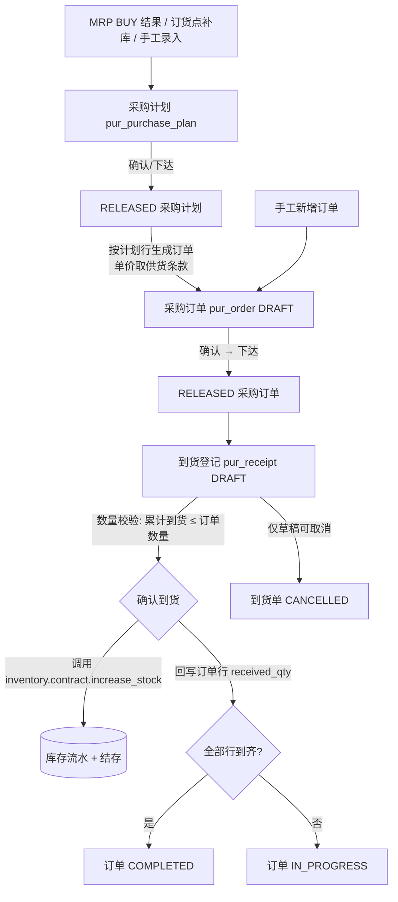

# 采购模块功能设计（Procurement Functional Design）

> 范围：采购模块的功能设计。表结构见 [physical-data-model.md](physical-data-model.md)，
> 实体关系见 [er-diagram.md](er-diagram.md)，页面见 [ui-design.md](ui-design.md)。

## 一、模块定位

采购模块是 MTS 业务闭环中的**物料供应执行方**：

```
Planning(MRP BUY 需求) ──┐
                         ├──▶ 采购计划 ──▶ 采购订单 ──▶ 到货登记 ──▶ Inventory(入库)
Inventory(订货点补库) ───┘                                                   │
                                                                             ▼
                                          实时库存反馈回 Planning / MRP（闭环）
```

- 采购模块**只执行采购**，不做需求计算（MRP 归 planning）、不维护库存（归 inventory）、不维护物料主数据（归 system）。
- 采购模块**永远不直接改库存**：到货确认只能调用 inventory 暴露的 Service Contract 写库存流水与结存。

## 二、业务边界

### 本模块做

1. 供应商主数据维护与启用/停用（不物理删除）
2. 供应商—物料供货关系维护（供货价、提前期、最小起订量、主供应商）
3. 采购计划：手工录入 + 承接 MRP/补库需求（头 + 行）
4. 采购订单：手工新增 / 由采购计划生成（头 + 行，金额自动计算）
5. 到货登记：按订单行登记到货数量与合格数量，确认后联动入库
6. 供应商评价：质量 / 交期 / 价格三维评分
7. 采购报表与统计：计划执行、订单到货进度、到货记录、未到货、评分汇总

### 本模块不做

- 供应商招标、合同法务、对账付款、发票（超出课程范围）
- MRP 运算、库存数量维护、物料主数据维护
- 不新增财务/质量等课程外模块

## 三、核心业务流程



关键业务规则：

1. **计划 → 订单**：只取计划行「未下单数量 = required_qty − ordered_qty > 0」的行；下单后**回写** `ordered_qty`；单价取该供应商对该物料的供货条款价 `supply_price`，预计到货日默认 = 下单日 + 最大供货提前期。
2. **到货数量控制**：一张到货单可多次登记，但同一订单行「本次到货 + 累计到货」不得超过订单数量，超出抛 `4004`。
3. **到货确认原子性**：库存入库流水、订单行已到货回写、单据/订单状态变更在**同一事务**内提交，任一失败整单回滚。
4. **历史不悬空**：到货单头冗余 `supplier_id`、到货行冗余 `material_id`，即使后续主数据变化，历史单据仍可追溯。
5. **编码自动生成**：计划 `PP{yyyyMMdd}0001`、订单 `PO{yyyyMMdd}0001`、到货单 `PR{yyyyMMdd}0001`，允许手工传入覆盖。

## 四、功能树

### 4.1 功能树总览

```
采购管理（procurement）
│
├── 1. 供应商管理（pur_supplier）
│   ├── 1.1 供应商列表查询
│   │   ├── 按关键词（编码/名称）模糊查询
│   │   ├── 按状态（启用/停用）筛选
│   │   └── 分页展示
│   ├── 1.2 供应商新增
│   │   ├── 编码唯一性校验（4001 重复）
│   │   ├── 必填：编码、名称
│   │   └── 默认状态 ACTIVE
│   ├── 1.3 供应商编辑
│   │   └── 修改联系信息、地址、备注
│   └── 1.4 供应商启停
│       ├── ACTIVE → INACTIVE（停用，不物理删除）
│       ├── INACTIVE → ACTIVE（重新启用）
│       └── 停用后不可被新订单选择（应用层校验）
│
├── 2. 供应商-物料关系管理（pur_supplier_material）
│   ├── 2.1 供货关系列表查询
│   │   ├── 按供应商筛选
│   │   └── 按物料ID筛选
│   ├── 2.2 供货关系新增
│   │   ├── (供应商, 物料) 唯一校验（4002 重复）
│   │   ├── 供应商必须存在且启用
│   │   └── 录入：供货价、提前期、最小起订量、是否主供应商
│   ├── 2.3 供货关系编辑
│   │   └── 修改供货条款与状态
│   └── 2.4 供货关系删除
│       └── 物理删除（供货条款非历史凭证，允许删除）
│
├── 3. 采购计划管理（pur_purchase_plan + pur_purchase_plan_item）
│   ├── 3.1 计划列表查询
│   │   ├── 按状态筛选
│   │   ├── 按计划日期区间筛选
│   │   └── 按计划编号关键词查询
│   ├── 3.2 手工录入计划
│   │   ├── 头：编号（留空自动生成 PP+日期+序号）、计划日期、备注
│   │   └── 行：物料ID、需求数量(>0)、需求日期、来源(MANUAL)、建议供应商
│   ├── 3.3 MRP 转计划（契约入口，planning 调用）
│   │   ├── 入参：mrp_result_ids
│   │   ├── 经 planning 契约读取 BUY 结果行
│   │   └── 幂等：同源未结计划复用补行
│   ├── 3.4 补库转计划（契约入口，inventory 调用）
│   │   ├── 入参：request_id
│   │   ├── 经 inventory 契约读取补库需求
│   │   └── 幂等：同源未结计划复用补行
│   ├── 3.5 计划编辑（仅 DRAFT）
│   │   └── 修改头与整单替换行
│   ├── 3.6 计划删除（仅 DRAFT）
│   │   └── 级联删除计划行
│   └── 3.7 计划状态流转
│       ├── DRAFT → CONFIRMED（确认）
│       ├── CONFIRMED → RELEASED（下达）
│       ├── RELEASED → COMPLETED（完成）
│       └── 非终态 → CANCELLED（取消）
│
├── 4. 采购订单管理（pur_order + pur_order_item）
│   ├── 4.1 订单列表查询
│   │   ├── 按供应商筛选
│   │   ├── 按状态筛选
│   │   ├── 按下单日期区间筛选
│   │   └── 按订单号关键词查询
│   ├── 4.2 手工新增订单
│   │   ├── 头：编号（自动生成 PO+日期+序号）、供应商、下单日期、预计到货、采购员
│   │   ├── 行：物料ID、数量(>0)、单价(≥0)
│   │   └── 金额 = 数量 × 单价，总额 = Σ 行金额
│   ├── 4.3 由计划生成订单
│   │   ├── 选择 RELEASED 计划 + 供应商
│   │   ├── 取计划行「未下单数量 > 0」
│   │   ├── 单价取 pur_supplier_material.supply_price
│   │   ├── 预计到货日 = 下单日 + 最大供货提前期
│   │   └── 保存时回写计划行 ordered_qty
│   ├── 4.4 订单编辑（仅 DRAFT）
│   │   └── 修改头与整单替换行
│   ├── 4.5 订单删除（仅 DRAFT）
│   │   └── 级联删除订单行
│   └── 4.6 订单状态流转
│       ├── DRAFT → CONFIRMED（确认）
│       ├── CONFIRMED → RELEASED（下达）
│       ├── RELEASED → IN_PROGRESS（到货确认自动推进）
│       ├── IN_PROGRESS → COMPLETED（全部到齐自动推进）
│       └── 非终态 → CANCELLED（取消）
│
├── 5. 到货登记管理（pur_receipt + pur_receipt_item）
│   ├── 5.1 到货单列表查询
│   │   ├── 按采购订单筛选
│   │   └── 按状态筛选
│   ├── 5.2 新增到货单（草稿）
│   │   ├── 选择可到货订单（CONFIRMED/RELEASED/IN_PROGRESS）
│   │   ├── 带出订单未到货行，默认到货量=未到货量
│   │   ├── 录入：收货仓库ID、到货日期、每行到货数量、合格数量、库位ID
│   │   └── 超交校验：累计到货 ≤ 订单行数量（4004）
│   ├── 5.3 确认到货（核心跨模块写操作）
│   │   ├── 仅 DRAFT 可确认
│   │   ├── 逐行调 inventory.increase_stock 入库（合格数量）
│   │   ├── 回写订单行 received_qty
│   │   ├── 到货单 → COMPLETED
│   │   ├── 订单 → IN_PROGRESS（部分到货）/ COMPLETED（全部到齐）
│   │   ├── 单事务原子性：库存契约缺失（4007）整单回滚
│   │   └── 操作日志（system 契约缺失静默跳过）
│   └── 5.4 取消到货单
│       └── 仅 DRAFT 可取消 → CANCELLED
│
├── 6. 供应商评价管理（pur_supplier_evaluation）
│   ├── 6.1 评价列表查询
│   │   └── 按供应商筛选
│   ├── 6.2 新增评价
│   │   ├── 三维评分：质量、交期、价格（0~100）
│   │   ├── 综合分 = 三项算术平均（后端计算，4 位小数）
│   │   └── 评价人ID（可选）
│   ├── 6.3 按供应商查询历史评价
│   │   └── 时间倒序展示
│   └── 6.4 删除评价
│       └── 物理删除
│
└── 7. 采购报表与统计
    ├── 7.1 计划执行报表
    │   └── 计划号、物料、需求数量、已下单、剩余、需求日期、来源
    ├── 7.2 订单到货进度报表
    │   └── 订单号、供应商、物料、数量、已到货、剩余、到货完成率、金额
    ├── 7.3 到货记录报表
    │   └── 到货单号、日期、订单号、供应商、物料、仓库/库位、到货/合格数量
    ├── 7.4 未到货报表
    │   └── 订单号、预计到货日、供应商、物料、数量、已到货、剩余（超期高亮）
    ├── 7.5 供应商评分汇总报表
    │   └── 供应商、评价次数、平均综合/质量/交期/价格分
    └── 7.6 模块统计（/stats）
        └── 供应商数、供货关系数、计划数、订单数、未到货行数、到货单数、评价数
```

### 4.2 各功能输入输出摘要

| 功能编号 | 功能名称 | 主要输入 | 主要输出 | 关键校验/规则 |
| --- | --- | --- | --- | --- |
| 1.1~1.4 | 供应商管理 | 编码、名称、联系人等 | 供应商档案 | 编码唯一（4001）；停用后不可被新单引用 |
| 2.1~2.4 | 供货关系 | 供应商、物料、价格、提前期 | 供货条款 | (供应商,物料) 唯一（4002）；供应商启用 |
| 3.2 | 手工计划 | 头+行（物料、数量、日期） | 采购计划单 | 数量 > 0；来源默认 MANUAL |
| 3.3 | MRP 转计划 | mrp_result_ids | 采购计划单 | 契约未就绪 4007；幂等复用 |
| 3.4 | 补库转计划 | request_id | 采购计划单 | 契约未就绪 4007；幂等复用 |
| 3.7 | 计划状态流转 | 目标状态 | 状态变更后的计划 | 非法流转 4006；终态不可改 4003 |
| 4.2 | 手工订单 | 头+行 | 采购订单单 | 金额自动计算；供应商启用 |
| 4.3 | 计划转订单 | 计划ID、供应商ID | 采购订单单 + 计划行回写 | 仅取未下单行；单价取供货条款 |
| 5.2 | 新增到货 | 订单ID、仓库、到货行 | 到货单（DRAFT） | 订单状态可到货；超交 4004 |
| 5.3 | 确认到货 | 到货单ID | 到货单（COMPLETED）+ 库存入库 | 单事务；库存契约缺失 4007；回写 received_qty |
| 6.2 | 新增评价 | 三维评分 | 评价记录 | 评分 0~100；综合分后端计算 |
| 7.1~7.6 | 报表统计 | 查询条件 | 报表数据 | 仅读 pur_* 表；名称由 system 契约补全 |

## 五、状态机

采购计划（`pur_purchase_plan.status`）：

```
DRAFT ──▶ CONFIRMED ──▶ RELEASED ──▶ COMPLETED
  │           │             │
  └───────────┴─────────────┴──────▶ CANCELLED
```

采购订单（`pur_order.status`）：

```
DRAFT ──▶ CONFIRMED ──▶ RELEASED ──▶ IN_PROGRESS ──▶ COMPLETED
  │           │             │
  └───────────┴─────────────┴──────▶ CANCELLED
```

- 仅 `CONFIRMED / RELEASED / IN_PROGRESS` 的订单允许登记到货。
- `COMPLETED / CANCELLED` 为终态；非法流转抛 `4006`，已确认后修改单据抛 `4003`。

到货单（`pur_receipt.status`）：`DRAFT ──确认──▶ COMPLETED`；`DRAFT ──取消──▶ CANCELLED`。

供应商/供货关系（`status`）：`ACTIVE ⇄ INACTIVE`（停用，不物理删除供应商；供货关系可物理删除）。

## 六、输入—处理—输出（IPO）

| 功能 | 输入 | 处理 | 输出 |
| --- | --- | --- | --- |
| 供应商管理 | 编码、名称、联系人、电话、邮箱、地址 | 唯一性校验、状态维护 | 供应商档案 |
| 供货关系 | 供应商、物料ID、价格、提前期、起订量 | (供应商,物料) 唯一约束；主供应商标记 | 可供货条款（订单取价依据） |
| 采购计划 | 物料、需求数量、需求日期、来源、建议供应商 | 头行保存、来源标记、已下单量回写 | 采购计划单 |
| MRP→计划 | MRP BUY 结果行ID（经 planning.contract） | 幂等受理：同源未结计划复用补行 | 采购计划单 |
| 补库→计划 | 补库需求ID（经 inventory.contract） | 同上（source_type=REORDER） | 采购计划单 |
| 采购订单 | 供应商、日期、行（物料/数量/单价） | 行金额=数量×单价、总额合计 | 采购订单单 |
| 计划→订单 | 计划ID、供应商、日期 | 取剩余行、条款取价、回写计划 | 采购订单单 |
| 到货登记 | 订单、仓库、到货行（订单行/数量/合格数/库位） | 超交校验、草稿保存 | 到货单 |
| 到货确认 | 到货单ID | 库存契约入库、回写 received_qty、状态推进 | 库存流水（inventory 侧）+ 已到货量 |
| 供应商评价 | 三维评分（0~100） | 综合分=三项均值（4 位小数） | 评价记录 |
| 报表统计 | 查询条件 | 本模块表聚合 | 计划/订单/到货/评分报表 |

## 七、接口清单（前缀 `/api/v1/procurement`）

| 分组 | 方法与路径 |
| --- | --- |
| 健康检查 | `GET /health` |
| 供应商 | `GET /suppliers`、`POST /suppliers`、`GET /suppliers/{id}`、`PUT /suppliers/{id}`、`POST /suppliers/{id}/status` |
| 供货关系 | `GET /supplier-materials`、`POST /supplier-materials`、`PUT /supplier-materials/{id}`、`DELETE /supplier-materials/{id}` |
| 可采购物料 | `GET /materials`（只读 system 契约，契约未就绪返回空数组） |
| 采购计划 | `GET /purchase-plans`、`POST /purchase-plans`、`GET/PUT/DELETE /purchase-plans/{id}`、`POST /purchase-plans/{id}/status` |
| 采购订单 | `GET /orders`、`POST /orders`、`POST /orders/from-plan`、`GET/PUT/DELETE /orders/{id}`、`POST /orders/{id}/status` |
| 到货 | `GET /receipts`、`POST /receipts`、`GET /receipts/{id}`、`POST /receipts/{id}/confirm`、`POST /receipts/{id}/cancel` |
| 评价 | `GET /evaluations`、`POST /evaluations`、`GET /evaluations/supplier/{supplier_id}`、`DELETE /evaluations/{id}` |
| 报表 | `GET /reports/plans`、`/reports/orders`、`/reports/receipts`、`/reports/pending`、`/reports/supplier-evaluation`、`GET /stats` |

统一响应 `{code, message, data}`；错误码区段 `4000~4999`：

| 码 | 含义 |
| --- | --- |
| 4000 | 入参/状态非法 |
| 4001 | 供应商编码（或业务单号）重复 |
| 4002 | 供应商-物料关系重复 |
| 4003 | 已确认/已下达/已完结单据不可修改 |
| 4004 | 到货数量超过未到货数量 |
| 4005 | 资源不存在 |
| 4006 | 单据状态不允许该流转 |
| 4007 | 跨模块契约尚未就绪 |

> 说明：develop 骨架的前端 `request.ts` 暂无 `patch` 方法，故状态流转统一用 `POST .../status`
> （与 `/confirm`、`/cancel` 动作式接口风格一致），不改动公共 `utils/request.ts`。

## 八、跨模块契约（边界铁律的落地）

采购模块**禁止 import 其他模块的 service / repository / models**。跨模块只走对方 `contract.py`：

| 方向 | 契约（惰性 import，未就绪时的行为） |
| --- | --- |
| 读 system | `system.contract.get_materials / get_material / search_materials`：补物料编码名称；未就绪 → 展示字段为空，不做物料存在性校验 |
| 读 system | `system.contract.get_personnel(_name)`：采购员/评价人姓名；未就绪 → 为空 |
| 写 inventory | `inventory.contract.increase_stock`：到货确认入库；未就绪 → 抛 `4007`，采购侧不落任何"已入库"状态 |
| 读 inventory | `inventory.contract.get_replenishment_request`：补库转计划；未就绪 → 抛 `4007` |
| 读 planning | `planning.contract.get_mrp_results`：MRP 转计划；未就绪 → 抛 `4007` |
| 写 system | `system.contract.log_operation`：操作日志；未就绪 → 静默跳过（日志不可阻塞业务） |

采购模块**对外暴露** `backend/app/modules/procurement/contract.py`：

- `create_purchase_plan_from_mrp(db, mrp_result_ids)` —— planning 把 BUY 结果转采购计划
- `create_purchase_plan_from_replenishment(db, request_id)` —— inventory 把补库需求转采购计划
- `get_pending_receipt_qty(db, material_id)` —— 某物料在途未到货量（planning MRP 可参考）

契约函数**永不 `db.commit()`**，运行在调用方事务内；同源单据幂等复用。

## 九、事务与分层约定

```
router  →  service（业务规则，不 commit）  →  repository（只读写 pur_* 表）  →  MySQL
              │
              └─▶ integrations（本模块内部的契约适配层，惰性 import 其他模块 contract）
              └─▶ contract（对外入口，不 commit）
```

- 路由层成功后统一 `db.commit()`；一次请求一个事务。
- repository 只查询本模块 9 张表，**不跨模块 JOIN**；跨模块显示名称由 service 批量取契约数据后在内存拼装。
