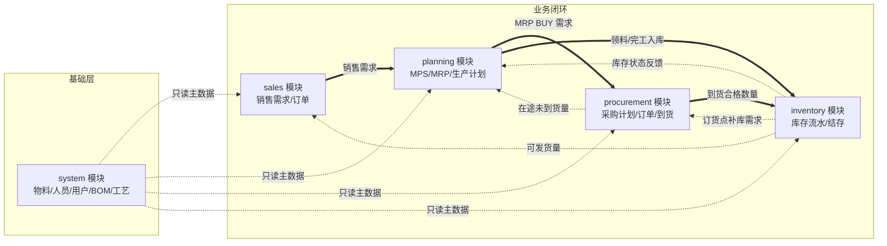
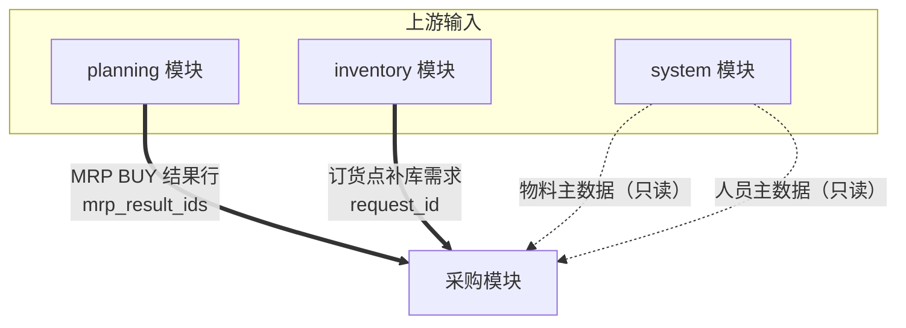
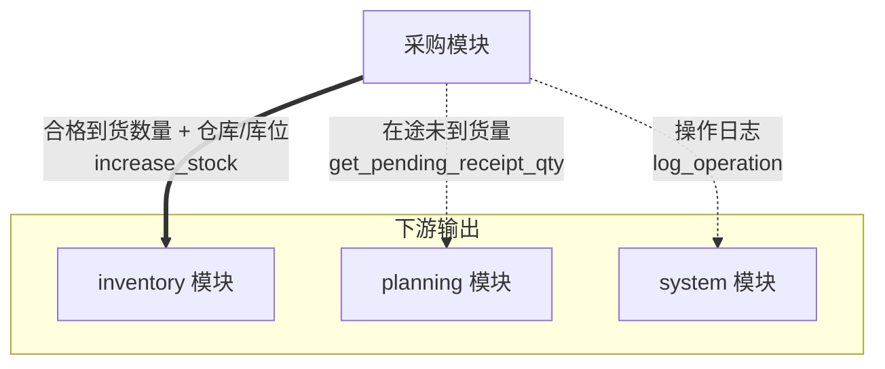
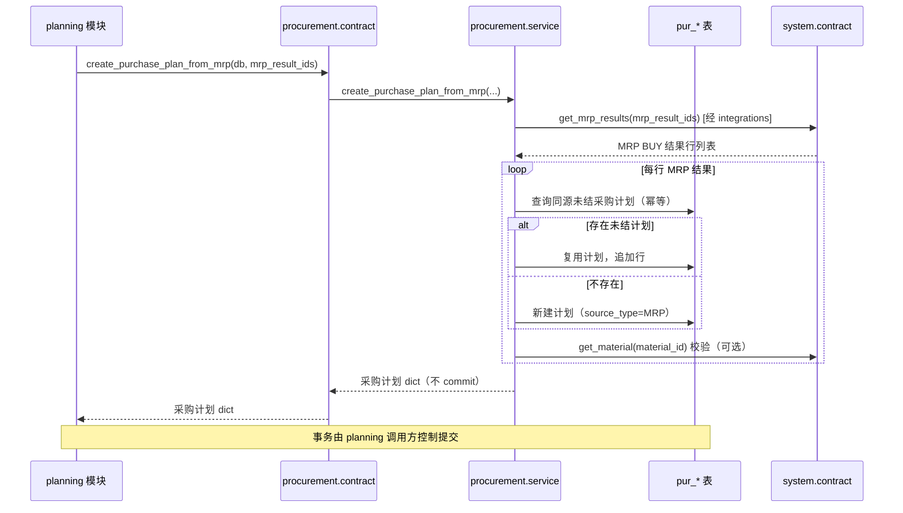
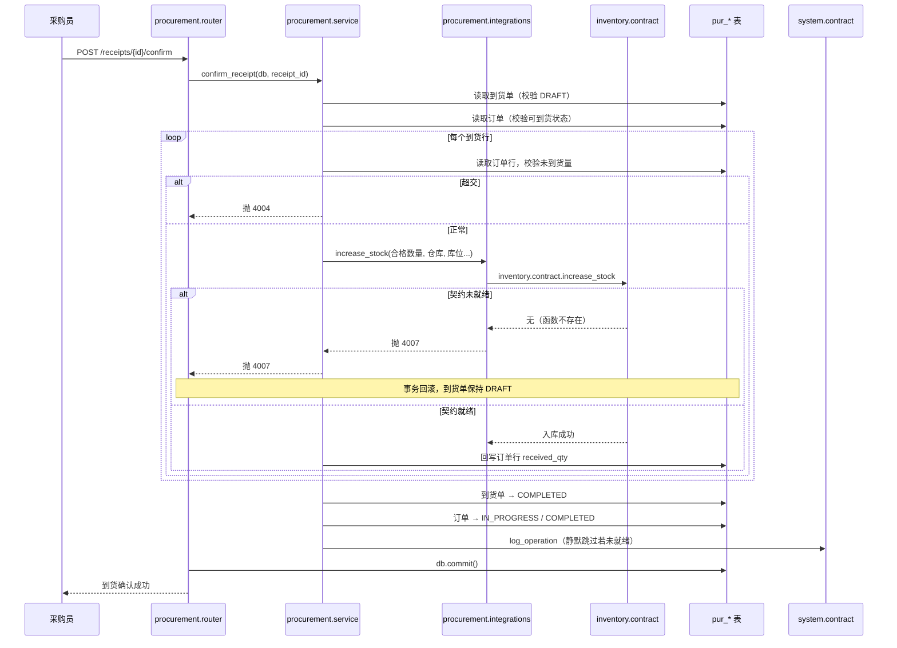
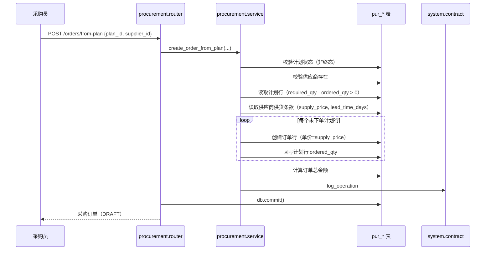

# 采购模块与其他模块的关系图

> 本文描述采购模块（procurement）在 MTS-ERP 系统中的位置，以及与 system、planning、
> inventory、sales 四个模块的交互关系。所有跨模块交互遵循
> [module-boundaries.md](../architecture/module-boundaries.md) 的铁律：
> **只通过 Service Contract（后端 `contract.py`）通信，禁止直接 import 对方的
> service/repository/models，禁止跨模块 JOIN。**

## 一、系统全景中的采购模块

**采购模块的定位**：连接「计划需求」与「库存入库」的执行环节，
消费 planning 的 MRP 外购需求与 inventory 的补库需求，产出采购订单与到货，
最终通过 inventory 契约将合格品入库。

## 二、采购模块的上下游关系

### 2.1 上游（向采购模块提供输入的模块）

| 上游模块 | 提供内容 | 契约函数 | 缺失时行为 |
| --- | --- | --- | --- |
| planning | MRP BUY 结果行（物料、需求数量、需求日期、来源） | `planning.contract.get_mrp_results` | 抛 4007，MRP 转计划不可用 |
| inventory | 订货点补库需求（物料、数量、建议供应商） | `inventory.contract.get_replenishment_request` | 抛 4007，补库转计划不可用 |
| system | 物料编码/名称、物料存在性 | `system.contract.get_material(s)` / `search_materials` | 只读：名称为空；校验：跳过 |
| system | 采购员/评价人姓名、人员存在性 | `system.contract.get_personnel` / `get_personnel_name` | 只读：姓名为空；校验：跳过 |

### 2.2 下游（采购模块向其输出的模块）

| 下游模块 | 接收内容 | 契约函数 | 缺失时行为 |
| --- | --- | --- | --- |
| inventory | 采购到货入库（物料、合格数量、仓库、库位、单价、来源单号） | `inventory.contract.increase_stock` | 抛 4007，到货确认失败，事务回滚 |
| planning | 某物料在途未到货数量（MRP 净需求参考） | 采购暴露 `contract.get_pending_receipt_qty` | planning 侧按需处理 |
| system | 操作日志（模块、动作、目标、操作人） | `system.contract.log_operation` | 静默跳过，不阻塞业务 |

## 三、详细交互时序

### 3.1 MRP → 采购计划（planning → procurement）

### 3.2 到货确认 → 库存入库（procurement → inventory）

### 3.3 计划转订单（procurement 内部 + system 只读）

## 四、跨模块数据依赖矩阵

| 本模块表 | 依赖的外部模块 | 依赖字段 | 引用类型 | 用途 |
| --- | --- | --- | --- | --- |
| pur_supplier_material | system | material_id | 逻辑引用+索引 | 可供货物料 |
| pur_purchase_plan_item | system | material_id | 逻辑引用+索引 | 需求物料 |
| pur_purchase_plan_item | planning/inventory | source_reference_id | 多态逻辑引用+索引 | MRP/补库来源单据 |
| pur_order | system | buyer_id | 逻辑引用+索引 | 采购员 |
| pur_order_item | system | material_id | 逻辑引用+索引 | 采购物料 |
| pur_receipt | inventory | warehouse_id | 逻辑引用+索引 | 收货仓库 |
| pur_receipt_item | system | material_id | 逻辑引用+索引 | 到货物料（冗余） |
| pur_receipt_item | inventory | location_id | 逻辑引用+索引 | 收货库位 |
| pur_supplier_evaluation | system | evaluator_id | 逻辑引用+索引 | 评价人 |
| 全部 9 张表 | system | created_by / updated_by | 逻辑引用（无索引） | 审计 |

## 五、模块边界红线

1. **采购模块永不直接读写其他模块的数据表**（包括 `sys_*`、`pln_*`、`inv_*`、`sal_*`）。
2. **采购模块永不直接 import 其他模块的 service/repository/models**。
3. **跨模块只走契约**：
   - 读 system：物料/人员（只读，缺失可降级显示 ID）
   - 写 inventory：入库（强一致，缺失必须失败 4007）
   - 读 planning/inventory：MRP/补库需求（缺失必须失败 4007）
   - 写 system：操作日志（缺失静默跳过）
4. **物理外键只建在模块内部**（9 张 `pur_` 表之间），跨模块只存 ID + 普通索引。
5. **采购模块对外暴露的 contract.py 永不 commit**，运行在调用方事务内。
